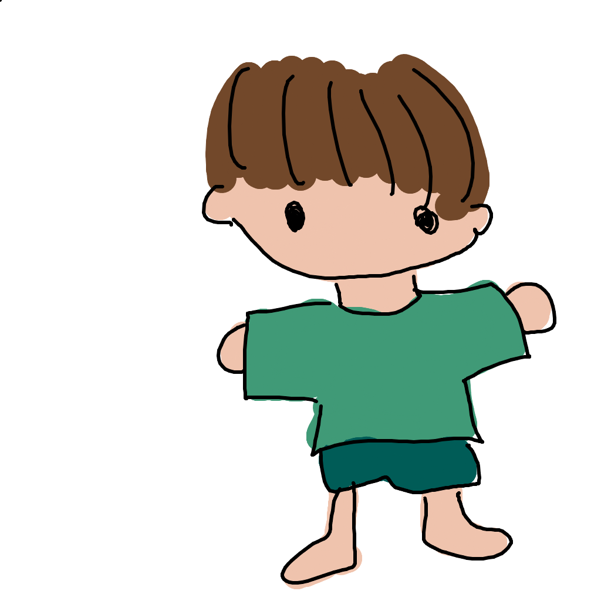
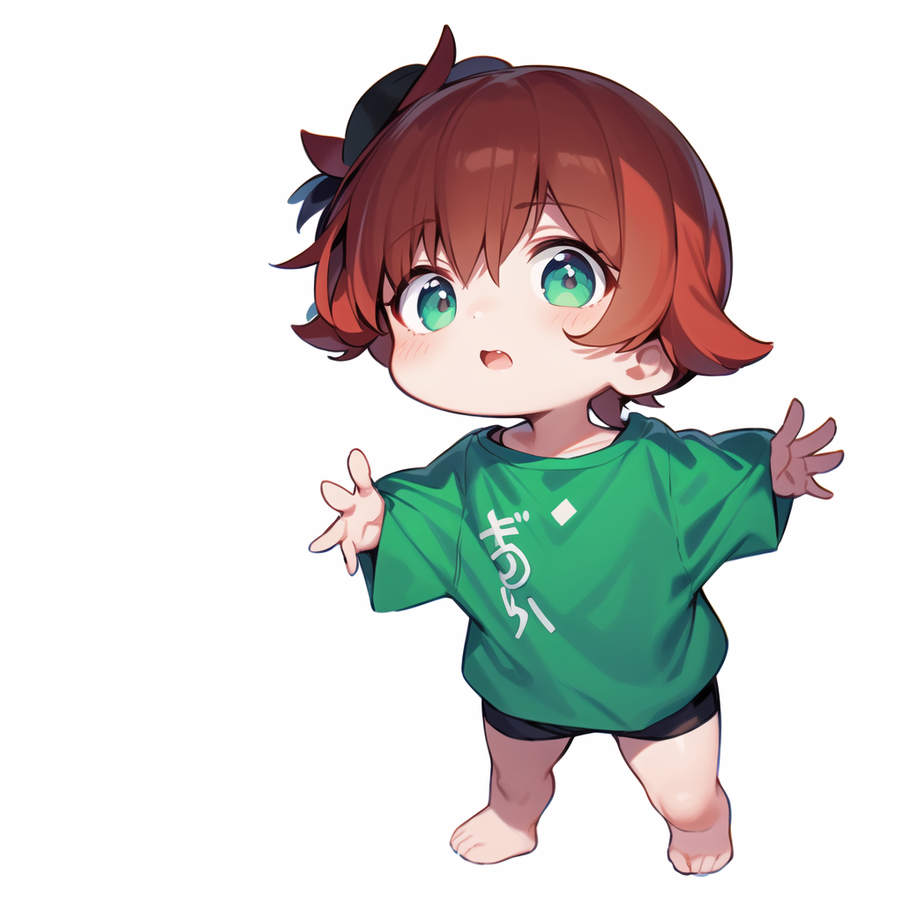
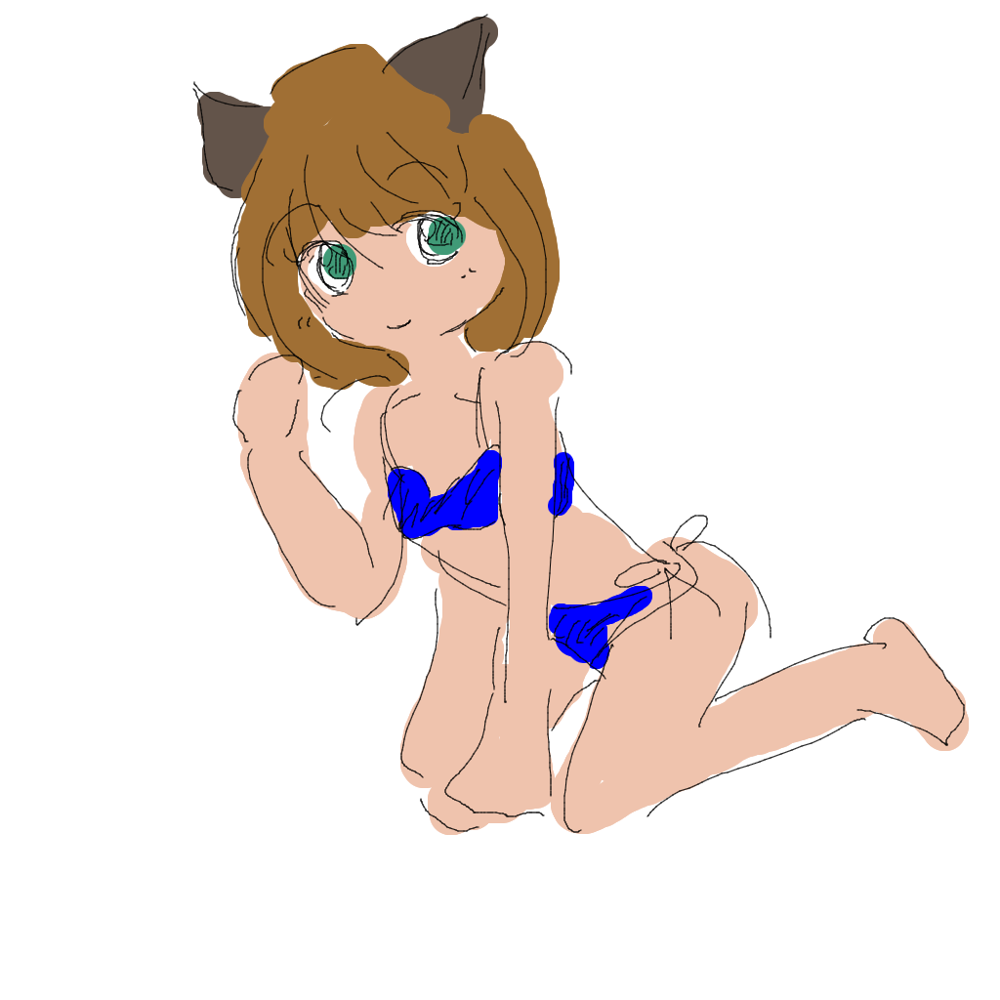
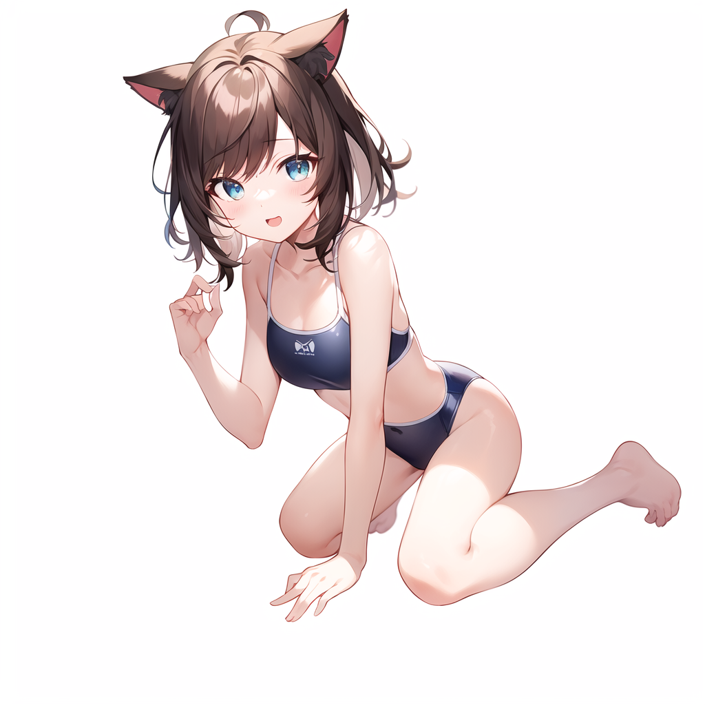
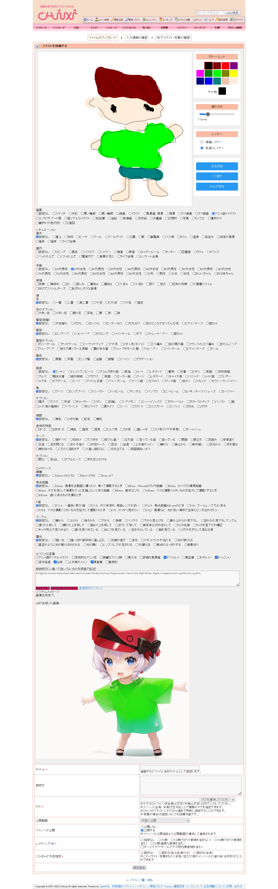

# cpaint-copilot-sdについて  
→
  
→
  
こちらは、「cardcapt/cpaint」をフォークし、AUTOMATIC1111氏の配布しているStable Diffusion web UIとの連携機能を追加したプログラムです。  
server.pyを実行することでWEBサーバーとして起動します。  
実行にはPythonが必要です。(Stable Diffusion web UIが動いていれば別途インストールは不要です。)  

# 初期設定  
「stable-diffusion-webui」フォルダーの中にある「webui-user.bat」を右クリック→編集などをしてテキストエディタで開き、「COMMANDLINE_ARGS」に以下の1行を追記します。  
```
 --api --cors-allow-origins=http://localhost:4212  
```
設定例：  
set COMMANDLINE_ARGS=--xformers --api --cors-allow-origins=http://localhost:4212  
※「webui-user.bat」を起動している場合は、「webui-user.bat」を再起動してください。  
  
# 起動方法  
初期設定を行った上でWindowsの場合、このファイルと同じ位置にある「start.bat」を実行します。  
その他OSの場合は、「python server.py」などで起動してください。  
「 Running on local URL http://127.0.0.1:4212 」という表示が出たら起動完了です。 
AUTOMATIC1111氏の配布しているStable Diffusion web UIがインストールされていない環境でこのプログラムを実行した場合は必要なライブラリがインストールされていない場合があります。  
その場合は適宜、pip installを行って下さい。
  
# 使い方  
ブラウザを使い「[http://localhost:4212/](http://localhost:4212/) 」へアクセスください。  
  
# cpaintの各種説明  
ページ上部は左がキャンパス部、右にツール部があります。  
左のキャンパス部にマウスやタブレットなどを使いお絵かきしてください。  
  
右のカラーパレッドは色の変更、線の太さは線の太さを1ピクセルから50ピクセルまで変更できます。  
レイヤーは線がレイヤーが上レイヤー、色塗りレイヤーが下レイヤーになっています。  
  
ツール部のレイヤーの下にあるボタンについては以下の通りです。  
- `１つ戻す`:１ストローク戻します。ショートカットCtrl+Zが使えます。  
- `最初から書き直す`:キャンパスをクリアします。ショートカットShift+Nが使えます。  
- `左右反転 `:キャンパスを左右反転します。  
- `下絵ON/OFF`:画像ファイルを読み込んだ場合、そのONとOFFを切り替えることが出来ます。  
- `色塗りON/OFF`:色塗りレイヤーのONとOFFを切り替え、下絵を表示するための機能です。  
- `PNGで保存`:キャンパスの情報をPNGファイルで保存します。ショートカットShift+Sが使えます。  
  
ページ中部はAIに作って欲しいイラストを選択するエリアです。  
ページ上部でキャンバスを使っている場合、絵で描いたものを選択してください。  
描かれていないものを選択してしまうとAIが混乱し生成物が崩れます。  
右側の数値は+にすれば強調、-はその逆です。  
選択下ものの中で特に気になるもの１つにだけ設定下さい。  
こちらも全てに指定するとAIが混乱し生成物が崩れます。  
  
相殺呪文  
例えば指が6本や足が3本になる画像の生成を避けたい場合、こちらに記述ください。  
  
システムメッセージ  
こちらに画像の進捗状況や画像の解析結果などが表示されます。  
  
- お絵かき+呪文で生成  
ページ上部のキャンバスで描いた画像とその下の選択肢を使ってイラストを生成する場合こちらをお使いください。  
- 下絵+呪文で生成  
取り込んだ画像ファイルとその下の選択肢を使ってイラストを生成する場合こちらをお使いください。  
- お絵かき+下絵+呪文で生成  
ページ上部のキャンバスで描いた画像と取り込んだ画像ファイル、その下の選択肢を使ってイラストを生成する場合こちらをお使いください。  
人物だけは加筆し、背景は取り込んだ画像ファイルを使いたい場合などに有用です。  
- 呪文だけで生成  
ページ上部のキャンバスは使わず、選択肢だけで画像を生成する場合こちらをお使い下さい。  
- 追加呪文のリセット  
選択肢をリセットします。  
  
画像の生成が始まるとページの一番下に  
AIに送信した画像、さらに生成が終わるとその下にAIが生成した画像が表示されます。  
生成状況については、システムメッセージを参照ください。  
  
# さいごに
こちらのコードを搭載している、お絵かきできるイラストSNS [Chixi(ちぃ)]に生成した画像を投稿していただけると幸いです！  

http://chixi.jp/  
  

